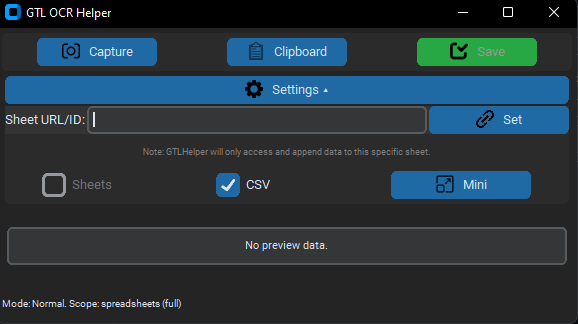

# Pokemmo GTL OCR Helper

A modern, user-friendly desktop application designed to streamline tracking your Global Trade Link (GTL) activities in Pokemmo. Capture single or multiple GTL listings using an in-app region selection tool or from your clipboard, let Tesseract OCR extract the details, and save the structured data (Item Name, Price, Date) directly to your personal Google Sheet and/or a local CSV file.

*Fig 1: GTL Helper - Normal Mode Interface*


*Fig 2: GTL Helper - Compact Mini Mode*
 


## Key Features

*   **Flexible Data Capture:**
    *   **In-App Region Selection:** Capture any part of your screen containing GTL listings (supports single or multiple lines).
    *   **Clipboard Processing:** Instantly process images of GTL listings copied to your clipboard (e.g., via `Win+Shift+S`).
*   **Accurate OCR & Parsing:**
    *   Powered by Tesseract OCR for text extraction.
    *   Intelligent parsing to structure OCR'd text into `Item Name`, `Price`, and `Date` (formatted as `dd/mm/yyyy`).
    *   Designed to handle the common "Price -> Name -> (Optional Type) -> Date" GTL format.
    *   Automatically processes both single and multiple listings from a region capture.
    *   Attempts to filter out common headers or irrelevant lines.
*   **Versatile Save Options:**
    *   **Google Sheets Integration:** Securely save data to *your own* Google Sheet using OAuth 2.0 user authentication.
    *   **Local CSV Export:** Save listings to a `gtl_listings.csv` file on your computer.
    *   Both save options are toggleable via checkboxes in the settings.
*   **Modern & Customizable UI:**
    *   Built with `CustomTkinter` for a sleek, modern dark theme.
    *   **Mini Mode:** Switch to an ultra-compact, icon-driven interface for minimal screen real estate usage.
    *   **Collapsible Settings Panel:** Access save preferences and sheet configuration easily.
    *   Always-on-top window functionality.
    *   Clear visual preview of parsed data before saving.
    *   Informative status bar for operational feedback.
*   **Efficient & Responsive:**
    *   Save operations to Google Sheets and CSV are performed in background threads to keep the UI snappy.
    *   Optimized OCR calls for single-line (clipboard) vs. multi-line (region) captures.

## Prerequisites

Before you begin, ensure you have the following installed on your system:

1.  **Python 3.7+:**
    *   Download from [python.org](https://www.python.org/).
    *   **Important for Windows users:** During installation, make sure to check the box that says **"Add Python to PATH"**.
2.  **Tesseract OCR Engine:**
    *   **Windows:**
        *   Download the installer from the [Tesseract at UB Mannheim page](https://github.com/UB-Mannheim/tesseract/wiki).
        *   During installation, ensure **"English" language data (`eng.traineddata`) is selected**.
        *   The script attempts to find Tesseract in its default installation path (`C:\Program Files\Tesseract-OCR`). If you install it elsewhere, you may need to update `TESSERACT_CMD_PATH` at the top of the Python script.
    *   **macOS:** The easiest way is via Homebrew: `brew install tesseract tesseract-lang`
    *   **Linux (Debian/Ubuntu based):** `sudo apt update && sudo apt install tesseract-ocr tesseract-ocr-eng`
3.  **A Google Account:** For saving data to Google Sheets.

## Setup Instructions

1.  **Download Application Files:**
    *   Download the main Python script (e.g., `gtlhelper.py`).
    *   Create a folder named `icons` in the same directory as the script.
    *   Place the required PNG icon files (see "Icon Setup" below) into this `icons` folder.

2.  **Install Python Dependencies:**
    *   Create a file named `requirements.txt` in the same directory as the script with the following content:
        ```txt
        customtkinter>=5.0.0
        Pillow>=9.0.0
        pytesseract>=0.3.8
        gspread>=5.0.0
        google-auth>=2.0.0
        google-auth-oauthlib>=0.7.0 
        # google-auth-httplib2 is usually a sub-dependency
        ```
    *   Open your terminal or command prompt, navigate to the application's directory, and run:
        ```bash
        pip install -r requirements.txt
        ```

3.  **Set Up Google OAuth 2.0 Credentials (for Google Sheets):**
    This allows the application to securely access *your* Google Sheets on your behalf. You only need to do this setup once for the application on your Google Account.

    *   **a. Create/Select a Google Cloud Platform (GCP) Project:**
        1.  Go to the [Google Cloud Console](https://console.cloud.google.com/).
        2.  If you don't have a project, create one. Otherwise, select an existing project.

    *   **b. Enable Necessary APIs:**
        1.  In your GCP project, go to **"APIs & Services" > "Library"**.
        2.  Search for and **Enable** the **"Google Sheets API"**.
        3.  Search for and **Enable** the **"Google Drive API"** (often required by `gspread`).

    *   **c. Configure the OAuth Consent Screen:**
        *(This is what you see when an app asks for permission to access your Google data)*
        1.  Go to **"APIs & Services" > "OAuth consent screen"**.
        2.  **User Type:** Choose **"External"**. Click **"CREATE"**.
        3.  **App information:**
            *   **App name:** Enter a name (e.g., "My GTL OCR Helper").
            *   **User support email:** Select your email address.
            *   **Developer contact information (Email addresses):** Enter your email address.
            *   Click **"SAVE AND CONTINUE"**.
        4.  **Scopes:**
            *   Click **"ADD OR REMOVE SCOPES"**.
            *   Find and select the **Google Sheets API** scope: `.../auth/spreadsheets` (Full access to all your spreadsheets).
            *   Click **"UPDATE"**.
            *   Click **"SAVE AND CONTINUE"**.
        5.  **Test users:**
            *   Click **"+ ADD USERS"**. Add your own Google email address(es) that you'll use with this app.
            *   Click **"ADD"**, then **"SAVE AND CONTINUE"**.
        6.  Review the summary and click **"BACK TO DASHBOARD"**.
            *   The "Publishing status" will be "Testing". This is fine for personal use with your added test email(s).

    *   **d. Create OAuth 2.0 Client ID for a Desktop App:**
        1.  Go to **"APIs & Services" > "Credentials"**.
        2.  Click **"+ CREATE CREDENTIALS"** > **"OAuth client ID"**.
        3.  **Application type:** Choose **"Desktop app"**.
        4.  **Name:** Give it a name (e.g., "GTL Helper Desktop Client").
        5.  Click **"CREATE"**.
        6.  A dialog will show your Client ID and Client Secret. Click **"DOWNLOAD JSON"**.
        7.  The downloaded file will be named something like `client_secret_[...].json`.
        8.  **Rename this file to exactly `client_secret_desktop.json`**.
        9.  Place this `client_secret_desktop.json` file in the **same directory** as the Python script.

4.  **Icon Setup (Recommended):**
    *   Create an `icons` subfolder in the application directory.
    *   Place the following PNG files (recommended size 20x20 to 32x32 pixels) inside the `icons` folder:
        *   `camera_icon.png`
        *   `clipboard_icon.png`
        *   `save_icon.png`
        *   `layout_icon.png` (for mini/full mode toggle)
        *   `settings_icon.png` (for the settings panel toggle)
        *   `link_icon.png` (for the "Set Sheet" button)
    *   If icons are not found, text/emoji fallbacks will be used.

## Running the Application

1.  Ensure all setup steps are complete.
2.  Open a terminal or command prompt.
3.  Navigate to the directory containing the Python script (e.g., `gtlhelper.py`) and the `icons` folder.
4.  Run the script:
    ```bash
    python gtlhelper.py
    ```

## First-Time Google Authentication

*   On the first run (or if `token.json` is deleted/invalid), a message box will explain the upcoming Google permission request.
*   Your web browser will open, asking you to log into your Google Account and grant the application permission to access your Google Sheets.
*   Review the permissions and click **"Allow"**.
*   You may see a warning that "Google hasn't verified this app." If you are using your own credentials or are a listed test user, you can proceed by clicking "Advanced" (if shown) and then "Go to [Your App Name] (unsafe)".
*   Once authorized, a `token.json` file will be created in the script's directory. This stores your authorization for future sessions. **Do not share your `token.json` file.**

## How to Use

The application window is always on top for easy access.

1.  **Set Target Google Sheet (Important for Google Sheets Saving):**
    *   Click the "⚙️ Settings" button to expand the settings panel.
    *   Paste the full URL or just the ID of your target Google Sheet into the "Sheet URL/ID" field.
    *   Click the "🔗 Set" button. The app will attempt to connect. The status bar will confirm success or failure.
    *   This Sheet ID is saved locally in `app_settings.json` for future sessions.

2.  **Capture Region & Preview (Recommended for Multi-Line GTL Data):**
    *   Click the "📷 Capture" button.
    *   The main app window will minimize. A semi-transparent overlay will cover your screen.
    *   Click and drag to draw a rectangle around the GTL listing(s) you want to capture.
    *   Release the mouse. The app window will reappear with the parsed data in the preview.

3.  **Preview Clipboard (Good for Single Quick Snips):**
    *   Copy an image of a GTL listing to your clipboard (e.g., on Windows: `Win+Shift+S`).
    *   Click the "📋 Clipboard" button in the app. The preview will update.

4.  **Review Preview:**
    *   **Normal Mode:** Displays "Name: [Item] | Price: [Value] | Date: [dd/mm/yyyy]". For multiple items, shows a count and the first item's details.
    *   **Mini Mode:** Shows a very compact summary (e.g., "Name..|Price (Count)").
    *   Check the console output for full details of all parsed items if multiple were captured.
    *   If incorrect, recapture or copy a new image and click the appropriate preview button again.

5.  **Save Previewed Data:**
    *   Once the previewed data is correct, click the green "💾 Save" button.
    *   Data is saved to Google Sheets and/or `gtl_listings.csv` based on your selections.
    *   The "Save" button is disabled if there's no valid data in the preview.

6.  **Settings Panel:**
    *   **Save to Sheets/CSV:** Toggle checkboxes to control save destinations. "Save to Sheets" is only enabled if a valid Google Sheet is loaded.
    *   **Mini Mode/Full Mode Button:** Switches the UI between the detailed normal layout and the compact icon-based mini layout.

## Troubleshooting

*   **`Tesseract Error` / No OCR:**
    *   Ensure Tesseract OCR is installed correctly and accessible via your system's PATH, or that `TESSERACT_CMD_PATH` in the script is accurate.
    *   Verify English language data for Tesseract is installed.
*   **`Icon load err ...` / Missing Icons:**
    *   Confirm the `icons` subfolder exists in the same directory as the script.
    *   Ensure all PNG icon files (e.g., `camera_icon.png`) are present in the `icons` folder and correctly named as per `icon_map` in the script.
*   **Google Sheets Authentication or Save Failures:**
    *   **`client_secret_desktop.json` missing:** Ensure this file (downloaded from GCP OAuth credentials setup) is in the script's directory.
    *   **`token.json` issues:** If you encounter persistent auth problems or scope errors ("invalid_scope"), try deleting `token.json` and re-authenticating through the browser flow.
    *   **API Errors (`PERMISSION_DENIED`, `NOT_FOUND`):**
        *   Double-check the **Sheet ID/URL** you entered in the app's settings.
        *   Ensure the Google account you authenticated with has **Editor access** to that specific Google Sheet.
        *   Verify that both **Google Sheets API** and **Google Drive API** are enabled in your GCP project.
        *   Check your internet connection.
*   **OCR Inaccuracy (`StructError: ...`, wrong text):**
    *   **Capture Quality:** Clear, tightly cropped captures of the GTL text work best. Avoid excessive background.
    *   **Game UI:** If the GTL interface in Pokemmo changes significantly, the OCR parsing logic (`structure_listing_data` function) might need updates. The current parser expects a "Price -> Name -> (Optional GTL/GM Type) -> Date" format from the OCR'd line.
    *   **Image Preprocessing:** You can experiment with `scale_factor` and `threshold` in the `preprocess_image` function if OCR is consistently poor. Uncomment the line to save `preprocessed_debug_image.png` to see what Tesseract is working with.
